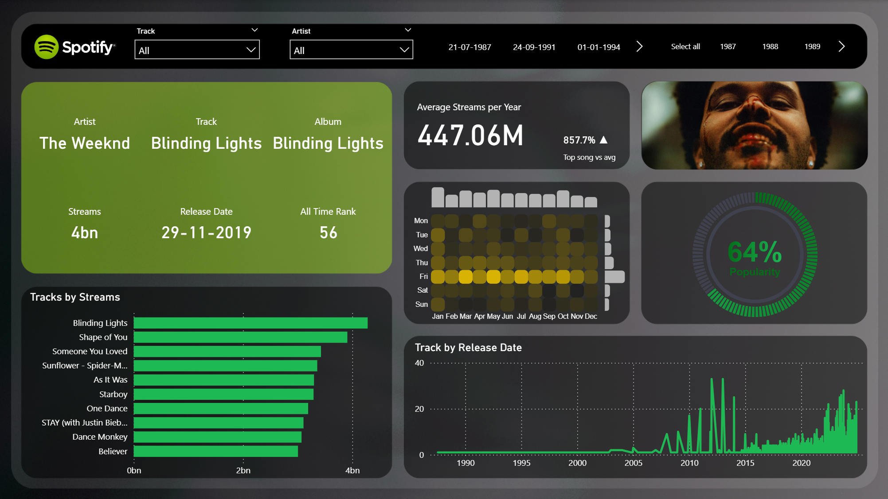

# 🎵 Spotify Most Streamed Songs 2024

### 📌 Project Overview

This project analyzes the most streamed songs on Spotify in 2024.
Using a Kaggle dataset and the Spotify API, I built an interactive Power BI dashboard to visualize streaming trends, album covers, and artist insights.
The dashboard includes heatmaps, unit maps, and customized visuals for a rich analytical experience.

## 🔍 Workflow
**1. Data Source**
  - Downloaded the dataset from Kaggle.
  - Retrieved album cover images using the Spotify API with Python.

**2. Data Cleaning & Transformation**
  - Cleaned and shaped the dataset in Power Query.

**3. Data Visualization in Power BI**
  - Built an interactive dashboard with multiple visuals:
    - 🎨 Album cover images styled using HTML visuals.
    - 🔥 Heatmap and unit map created with Deneb visual.
    - 📊 Charts and KPIs for top artists, albums, and songs.

## 🛠️ Tech Stack
- **Dataset:** Kaggle (Spotify Most Streamed Songs 2024)
- **API:** Spotify Web API (for album covers)
- **Data Processing:** Python, Power Query
- **Visualization:** Power BI (HTML Visual, Deneb Visual)

## 📸 Dashboard Preview

## 📊 Key Insights
- Highlighted top streamed songs and artists of 2024.
- Displayed album covers dynamically retrieved from Spotify API.
- Used heatmaps to show streaming intensity across metrics.
- Built unit maps for comparative analysis of top tracks.
